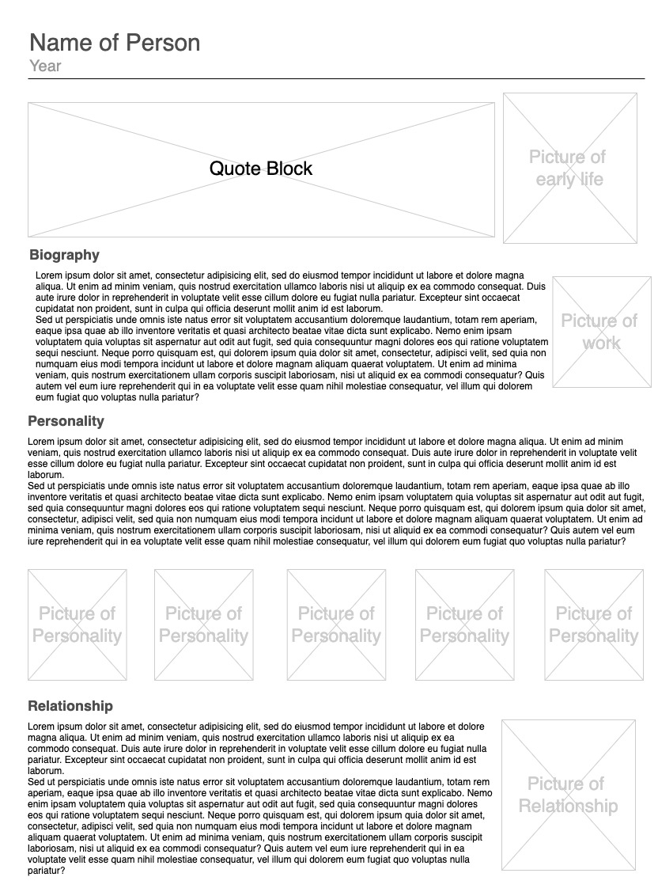

WADP 410 Lab #2
===

1. List 3 things on what you like about **Google Class** UI design:
	 | Pro                                  | Con                                                |
   | ------------------------------------ | -------------------------------------------------- |
   | Very clean and simple desing         | lack of explanation for those who never use before |
   | very easy to create classroom        | unable to archive the finished class from student  |
   | banner background styles are limited | interaction between classmates are limited         |

2. 

3. [Webpage from wire frame](./biography.html)
